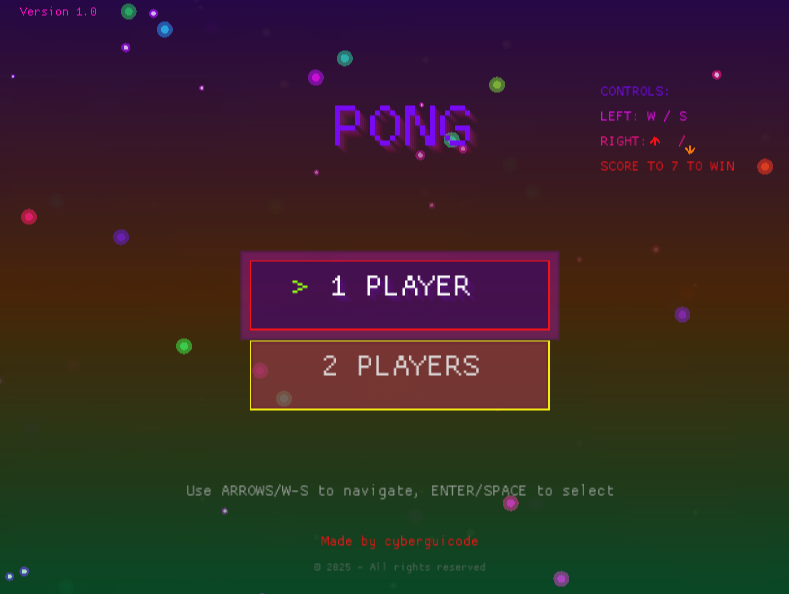

# Colorful Pong Game

A vibrant, animated version of the classic Pong game built with Rust and Macroquad.

<div align="center">




## Features

- **Rainbow Visual Effects**: Animated rainbow colors throughout the game with smooth color transitions
- **Enhanced Menu**: Beautiful menu with animated stars, floating particles, option boxes with glow effects, controls display, version info, and credits
- **Particle System**: Explosive particle effects on paddle collisions
- **Trail Effects**: Beautiful glowing trails following paddles and ball
- **Menu System**: Choose between 1-player (vs AI) or 2-player modes with visual feedback
- **Smooth Animations**: Fluid movement and visual effects
- **Glow Effects**: Glowing paddles and ball with dynamic lighting
- **Screen Shake**: Impact effects on collisions
- **Audio System**: Framework ready for music and sound effects (can be extended with audio files)

## Controls

### Menu
- **Arrow Keys / W-S**: Navigate menu options
- **Enter / Space**: Select option

### During Game
- **1 Player Mode**:
  - Left paddle: **W** (up) / **S** (down)
  - Right paddle: AI controlled

- **2 Player Mode**:
  - Left paddle: **W** (up) / **S** (down)
  - Right paddle: **Arrow Up** / **Arrow Down**

- **Pause**: **P** or **ESC** to pause/resume the game

## Installation

Make sure you have Rust installed. Then run:

```bash
cargo run
```

## Building

To build a release version:

```bash
cargo build --release
```

The executable will be in `target/release/rust_pong_v3`.

## Requirements

- Rust 2021 edition or later
- Macroquad game framework
- Rand crate for random number generation

## Game Rules

- First player to reach 7 points wins
- Ball speeds up after each paddle hit
- Ball bounces off top and bottom walls
- Score when ball passes opponent's paddle

## Menu Features

The menu includes:
- **Animated Background**: Rainbow gradient that smoothly transitions
- **Stars Field**: 30 animated stars that fall from top to bottom with varying brightness
- **Floating Particles**: 15 colorful particles that float around the screen
- **Option Boxes**: Visual boxes for menu options with glow effects when selected
- **Controls Display**: Shows game controls on the right side
- **Version Info**: Displays version number in the top-left corner
- **Credits**: "Made by cyberguicode" with rainbow animation
- **Copyright**: Footer with copyright information

## Audio System

The game includes an audio system framework (`src/audio.rs`) that can be extended to play music and sound effects. To add audio files:

1. Place your music files (WAV or OGG format recommended) in an `assets/` folder
2. Use `macroquad::audio::load_sound_from_file()` to load them
3. Use `play_sound()` with appropriate parameters
4. For royalty-free music, check resources like:
   - Pixabay (pixabay.com/music)
   - Freesound (freesound.org)
   - OpenGameArt (opengameart.org)

The audio system is structured to support:
- Background music for menu
- Background music for gameplay
- Sound effects for paddle hits
- Sound effects for scoring
- Sound effects for menu navigation

Enjoy the colorful, aesthetic Pong experience!

